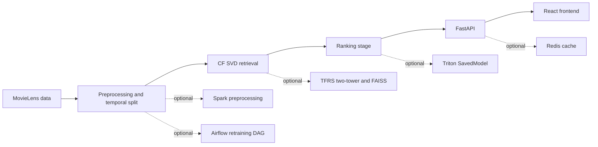

Architecture

```mermaid
flowchart LR
  A[MovieLens data] --> B[Preprocessing and temporal split]
  B --> C[CF SVD retrieval]
  C --> D[Ranking stage]
  D --> E[FastAPI]
  E --> F[React frontend]
  C -. optional .-> G[TFRS two-tower and FAISS]
  E -. optional .-> H[Redis cache]
  B -. optional .-> I[Spark preprocessing]
  D -. optional .-> J[Triton SavedModel]
  B -. optional .-> K[Airflow retraining DAG]
```

CF SVD is the primary retrieval model. Two-tower retrieval is experimental and has zero Recall@10. Spark, Airflow, Triton, and Redis server integration are not fully verified.
